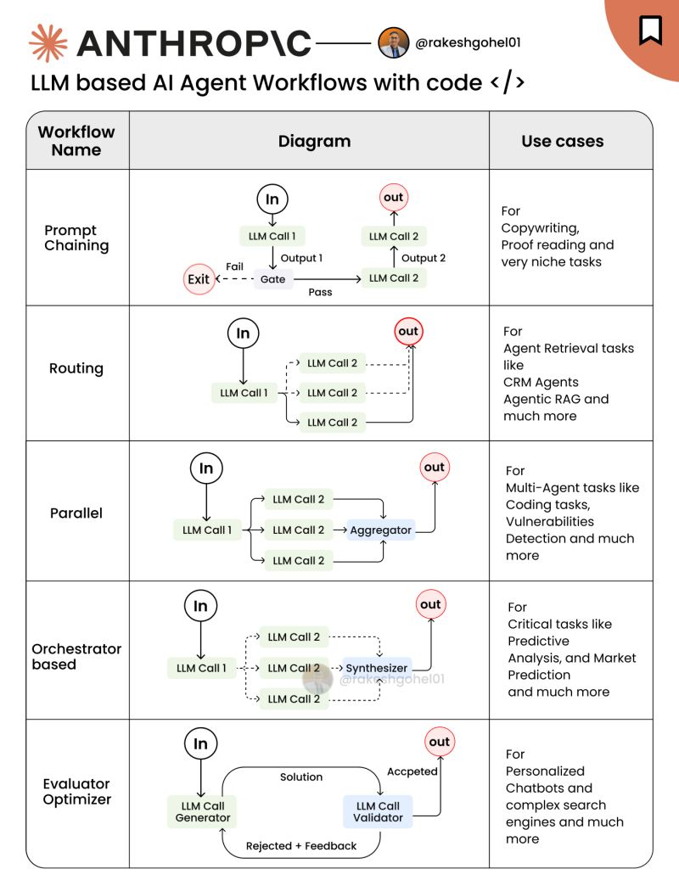

# Agentic AI Design Patterns

Agentic design patterns, as introduced by Anthropic, are architectural and behavioral templates for building effective AI systems powered by large language models (LLMs). The focus is on simplicity, transparency, and practical composability over complex frameworks.

These patterns aim to make AI systems modular, scalable, and adaptable, emphasizing simple designs that can be enhanced only when needed, as informed by Anthropic’s experience with real-world implementations.

[Building effective agents By Anthropic](https://www.anthropic.com/research/building-effective-agents)

This detailed analysis of [Anthropic’s guide](https://www.anthropic.com/research/building-effective-agents) should serve as a comprehensive overview and critical appraisal of the strategies for building effective agents. Each point is well grounded in practical considerations, and while some trade-offs (like the cost of complexity) exist, the emphasis on simplicity and iterative improvement is sound engineering advice.Building effective AI agents involves understanding and implementing foundational patterns that enable systems to perform tasks autonomously or semi-autonomously. Leveraging insights from Anthropic's research on building effective agents and utilizing OpenAI's recently released Agents SDK, developers can create robust AI systems tailored to specific needs.

**1. Defining Agents and Workflows**

- **Agents**: Autonomous systems capable of perceiving their environment, making decisions, and acting upon that environment to achieve specific goals. They dynamically direct their processes and tool usage, maintaining control over task execution.

- **Workflows**: Structured sequences of predefined steps aimed at completing tasks efficiently. In AI, workflows involve orchestrating Large Language Models (LLMs) and tools through predetermined code paths, offering predictability and consistency for well-defined tasks.

**2. Augmented Large Language Models (LLMs)**

At the core of agentic systems is the concept of augmented LLMs—models enhanced with additional capabilities to interact more effectively with their environment. These augmentations include:

- **Retrieval**: Accessing and incorporating external information sources, allowing the agent to fetch relevant data beyond its initial training.

- **Tools**: Integration with external functions or APIs enables the agent to perform specific operations, such as calculations, data processing, or interacting with other software systems.

- **Memory**: Maintaining context or state over interactions allows the agent to remember previous exchanges, user preferences, or important data points, leading to more coherent and personalized interactions.

**3. Implementing Patterns with OpenAI Agents SDK**

The OpenAI Agents SDK is designed to be highly flexible, allowing developers to model a wide range of LLM workflows, including deterministic flows, iterative loops, and more. Key patterns include:

**a. Prompt Chaining**

This pattern involves decomposing a complex task into a sequence of steps, where each step's output serves as the input for the next. This sequential processing allows for methodical handling of intricate tasks.

**b. Routing**

Routing directs tasks to different agents or models based on the nature of the input. By assessing the complexity or type of a task, the system can allocate it to the most appropriate agent, ensuring efficient handling.

**c. Parallelization**

Parallelization enables the simultaneous processing of multiple tasks, thereby improving efficiency and reducing latency. This pattern is particularly useful when dealing with tasks that can be executed independently.

**d. Orchestrator-Workers**

In this pattern, a central orchestrator agent delegates subtasks to multiple specialized worker agents and aggregates their results. This division of labor allows for scalable and organized processing of complex tasks.

**e. Evaluator-Optimizer**

This pattern involves one agent generating potential solutions and another evaluating and optimizing them. The evaluator provides feedback, guiding the optimizer to refine its outputs, leading to improved results over iterations.

**4. Best Practices**

- **Start Simple**: Begin with straightforward implementations and add complexity only as necessary. This approach allows for manageable development and easier debugging.

- **Understand Frameworks**: If using frameworks, ensure a clear understanding of the underlying processes to maintain control and debuggability. A deep comprehension of the framework's mechanics aids in effective customization and troubleshooting.

- **Tailor Augmentations**: Customize tools and memory to align with specific use cases, enhancing the agent's effectiveness. Tailored augmentations ensure that the agent's capabilities are directly relevant to the tasks it needs to perform.

By employing these patterns and best practices, developers can create robust and efficient AI agents using the OpenAI Agents SDK, tailored to their unique requirements.

For a visual walkthrough and practical examples, you might find this helpful:

